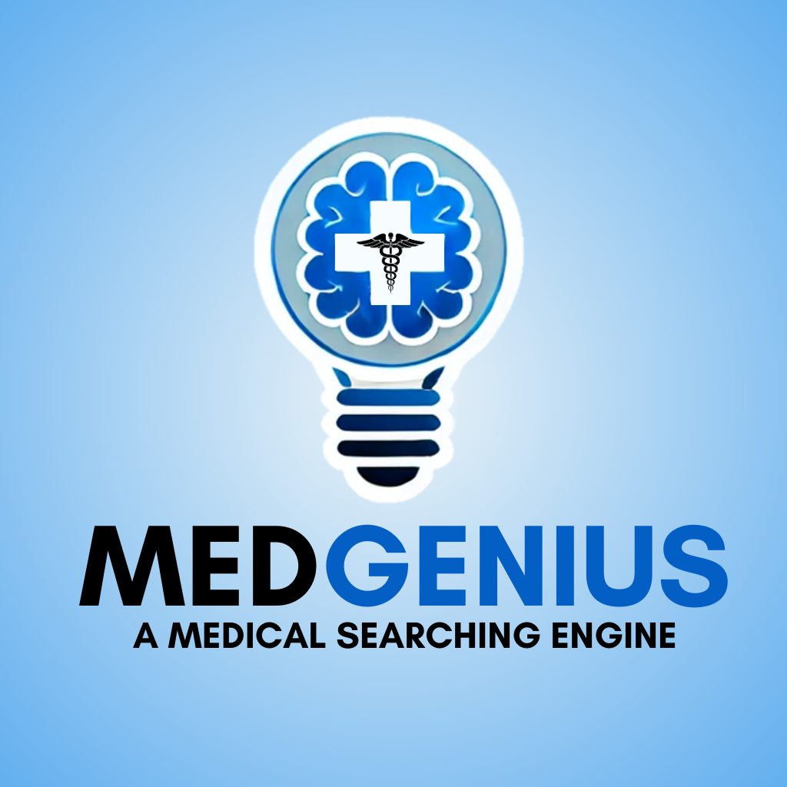

# MEDGENIUS: Target Users and Expected Benefits

## Target Users
- **General Practitioners and Specialists at CHA Hospital**
  - MEDGENIUS is designed primarily for general practitioners and specialists at CHA Hospital.

## Key Features
- **Providing Medical Standards**
  - The model offers comprehensive medical standards for healthcare professionals.
- **Quick Search Capability**
  - Enables quick searches for information outside of their specialty or for details they may have forgotten.

## Expected Benefits
- **Time Efficiency and Accuracy Improvement**
  - Saves time while enhancing the accuracy of diagnosis and treatment.
- **Patient-Centered Care**
  - Allows for personalized care tailored to each patient's specific needs, rather than standardized, one-size-fits-all treatments.
