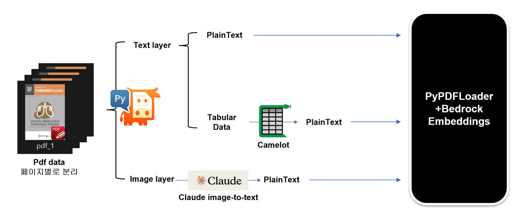

# **MEDGENIUS** : Feed Gigabytes of Clinical Guidelines for Accurate Medical Practice

### - by SNUH Hackathon team 2


We Leveraged RAG(Retrieval Augmentation Generation) technology to search and implement clinical guidelines for real use.

## Target Users
- **General Practitioners and Specialists at CHA Hospital**
  - MEDGENIUS is designed primarily for general practitioners and specialists at Primary Hospitals.

## Key Features
- **Providing Medical Standards**
  - The model offers comprehensive medical standards for healthcare professionals.
- **Quick Search Capability**
  - Enables quick searches for information outside of their specialty or for details they may have forgotten.

## Expected Benefits
- **Time Efficiency and Accuracy Improvement**
  - Saves time while enhancing the accuracy of diagnosis and treatment.
- **Patient-Centered Care**
  - Allows for personalized care tailored to each patient's specific needs, rather than standardized, one-size-fits-all treatments.

-----
# How to Set Up

## 1. Create a Conda Virtual Environment

```bash
conda create -n my_env python=3.12
```

## 2. Activate the Virtual Environment
```bash
conda activate my_env
```

## 3. Clone the Git Repository
```bash
git clone https://github.com/owenchokor/medgenius.git
cd medgenius
```
## 4. Download Requirements
```bash
pip install -r requirements.txt
```

----
# How to Use
```bash
python script.py --bucket_name snuh-data-team2 --pdf_source download --preprocess True
```
**arguments**
- bucket_name : Your S3 bucket name.
- pdf_source : You can either use your local pdf files(local) or files from the S3 bucket(download).
- preprocess : We implemented tabular data and image preprocessing to feed in the RAG model. Pass --preprocess True to enable preprocessing, and False to use only plaintext.
  
The diagram below shows out preprocessing scheme.


